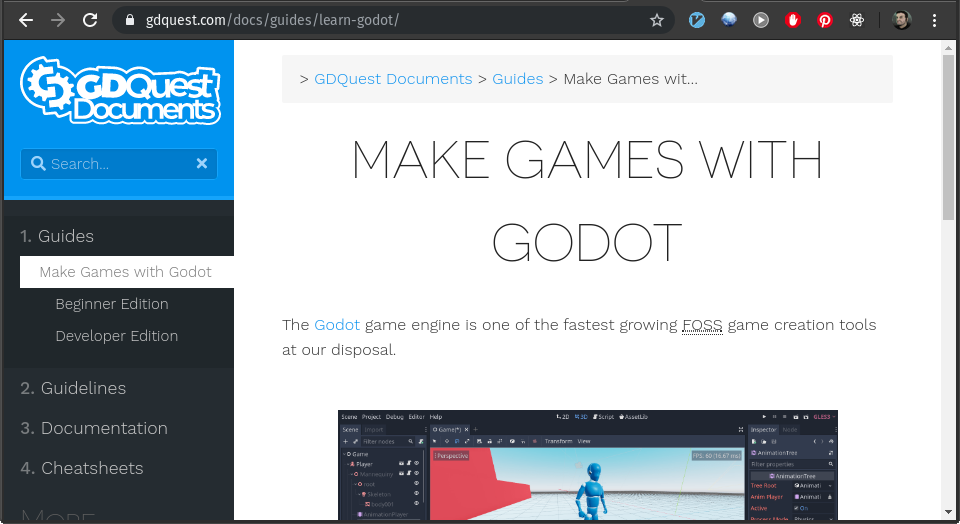

+++
title = "Godot learn paths are live!"
description = "Part of the 2019 Godot course Kickstarter campaign, the stretch goal of creating learning paths for anyone wanting to check out Godot has been met."
author = "razvan"

date = 2019-12-11T17:52:21+02:00
weight = 5
#draft = true

categories = ["news"]
tags = ["gdquest", "gdquest website", "website", "godot", "godotengine", "education", "learn", "faq"]
+++

<!-- If this file goes under contents/docs be sure to start chapters with ##, not # -->

Our 2019 [Godot](//godotengine.org) course Kickstarter campaign included a few stretch goals that were backed by our wonderful supporters. One of them has to do with creating a [learning path]() for anyone interested in experimenting, but also doing serious projects in Godot, covering all the spectrum - from beginners with zero-programming experience to advanced game developers that want to check out what Godot has to offer.

## Learning Path is Live

Taking advantage of the new website development we've been doing to improve your experience, we have created a home for our "living" documents. The Godot learn path has made a very cosy home in there. The two documents are:

1. a [beginner-friendly, zero-programming experience document]() for starting off on your adventure using Godot
1. a [developer heavy-handed document]() that is straight to the point and doesn't linger on tangential topics of no interest

## How to use the guides

These documents are in the form of **curated lists of free educational resources**, compiled with a lot of care and thought. While the beginner-friendly document has a bit of a longer introduction and some more developed paragraphs explaining some introductory bits, the developer edition goes straight to the meat and doesn't linger on non-important topics.

### Make Games with Godot: Beginner Edition

The beginner edition document is full of hands-on content that relies a lot more on educational resources that get you started rather than explaining the theoretical side. Learning by doing practical projects is the best way when it comes to programming and especially game development, as by design, it is a visually-driven activity, with very few exceptions.



After preliminary projects, you're presented with a list of educational resources that explores the design aspect of game making.

The last section encourages you to go explore some more in-depth topics such as shaders (they are not as scary as you might think, especially in Godot!), Godot's very own introduction to math for game developers and a bit of Python as GDScript, the main scripting language in Godot, is heavily inspired by Python.

### Make Games with Godot: Developer Edition

This document is no joke. You're thrown head-first in the depths of Godot exploration. We start straight to the point by listing the available "From X to Godot" resources available to date.



Then comes Godot UI, themes, but much more. There is an interest in exploring the desktop-application making side of Godot since it's rather versatile, having a very powerful theming engine and all sorts of ready-made widgets to work with. This is an interesting topic to explore for anyone that wants to build their own tools and have fun with it.

We follow up with a deep-dive into the shader land, then looking at extending Godot with plugins and in-editor tools, multiplayer development options and a very cool advanced tutorial by Bastiaan Olij on vehicle simulation.

We finish up with two more useful lists for anyone that dives into complex problems: getting help when stuck and finally a top-quality list of extra resources to explore, that are not Godot-specific, but are very useful to know about.

## Extra: contributing

As part of this task, we have created [contributors guidelines]() for anyone wanting to expand on these documents. They are "living" documents after all and require constant care as Godot improves and breaks compatibility with previous versions. We hope you are as excited as we are about these contributions to our wonderful community!

## Last words

This work is made possible by you and the backers of our project. Without your help this wouldn't have been possible. We give you a warm thanks and we hope you'll consider helping us out keeping these content up to date!
