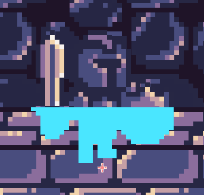
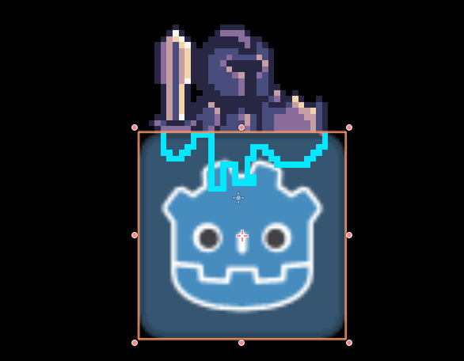
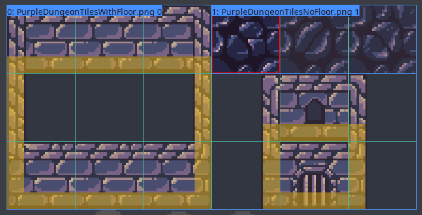
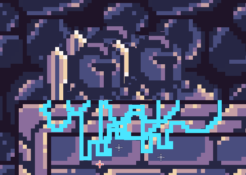

+++
title = "Drawing a character's silhouette"
description = "Display the silhouette of a character hidden behind a wall."
author = "azagaya"

date = 2021-01-23T13:26:00-03:00
weight = 5

difficulty = "intermediate"
keywords = ["godot silhouette tutorial", "godot xray", "godot see through walls", "godot character outline"]
+++

In this tutorial, you will learn how to use viewports and shaders to display an outline when a wall hides a character in Godot.


The technique we'll use here requires GLES3 as we'll write pixel values higher than `1` to the screen buffer.

To achieve that, we'll use a viewport and two sprites and shaders to draw the hidden part of an animated sprite as a silhouette and the rest normally.

The trick consists of first rendering your character to a texture using a `Viewport` node. We then display the texture twice on two stacked sprites. The first one acts as a mask and allows us to detect which parts of the character are visible or not. The second, using a shader, draws a silhouette around the invisible parts.

_You can find the open-source demo for this tutorial on our [Godot mini tuts repository](https://github.com/GDQuest/godot-mini-tuts-demos/tree/master/shaders/silhouette2D). There, you'll find the sprites and resources to follow along this tutorial. We prepared a character and a tileset. Alternatively, you can use any character and level you'd like._

We'll start by setting up the character scene with a viewport and two sprites. We'll then use two shaders to render the mask and detect the character's occluded areas.

## Setting up the Character scene

Start by creating a new scene with a `KinematicBody2D` as the root node named _Character_.

Add a `Viewport` node and an `AnimatedSprite` as a child of it and assign it our `guard.png` image.

We will use the viewport to render the character's animations to a texture that we can apply to two sprites we'll create next.

Add two `Sprite` nodes to the scene, and name them respectively _Mask_ and _Sprite_.

Also, add a `CollisionShape2D` as a child of the `KinematicBody2D` and in the _Inspector_, give it a `RectangleShape2D`. 

Your scene should look like this:


Select the _Sprite_ and, in the _Inspector_, set its _Z Index -> Z Index_ to a high value like `100`. We'll use it to display the silhouette, which we want to render above walls and other objects. That's why we want to set the z-index so high.

Also, set the offset of both sprites to `(0, -16)` to align the guard's feet with the scene's origin.

Next, let's configure the viewport. Select the _Viewport_ node and set both its _Width_ and _Height_ to `32`. 


You should adapt those values to the size of the sprite(s) you want to render inside the viewport. Our guard fits in a 32x32 square.


Make sure to check the _Transparent Bg_ option. Without this, the rendered texture will have a solid background color.

Under the _Render_ category in the inspector, disable _HDR_ and change the node's _Usage_ to _2D_. Also, check the option _Render Target -> V Flip_, as, by default, the texture will render upside-down.

Lastly, change the _Update Mode_ property to _Always_. Your viewport's settings in the inspector should look like this:


As the viewport's top-left corner corresponds to the scene's origin, we need to offset the _AnimatedSprite_ node or it'll get cropped. Set its _Transform -> Position_ to `16` in both `x` and `y`.

 Remember to set an animation to the `AnimatedSprite` using the provided assets. Configuring an animated sprite is beyond the scope of this tutorial. 

You won't see anything yet, because we need to set what the viewport is rendering as the texture for both sprites. So, for both _Mask_ and _Sprite_, in the _Inspector_, set their _Texture_ to a _New ViewportTexture_ and assign the viewport node to that viewport texture. Once you've done that, you should see the guard's sprite.

For testing purposes, I added the following script to the `KinematicBody2D` node to move it:

```gd
extends KinematicBody2D

export var speed := 100.0

onready var animated_sprite := $Viewport/AnimatedSprite


func _physics_process(_delta) -> void:
	# We calculate the input direction and normalize the vector.
	var direction := Vector2(
		Input.get_action_strength("ui_right") - Input.get_action_strength("ui_left"),
		Input.get_action_strength("ui_down") - Input.get_action_strength("ui_up")
	).normalized()

	# And we move the character at a constant speed.
	move_and_slide(direction * speed)

	# We also flip the source animated sprite based on the input direction.
	if direction.x != 0:
		animated_sprite.scale.x = sign(direction.x)
```

You can save this scene as `Character.tscn`
	
## Drawing the mask and the silhouette

We will use two shaders to accomplish this effect: one draws a mask to distinguish the parts of the character that are behind an obstacle. The other uses the mask to either draw the character's texture or an outline of it.

Add a shader to the _Mask_ node with the following code.

```glsl
shader_type canvas_item;

void fragment() {
	float alpha = texture(TEXTURE, UV).a;
	COLOR.r = 10.0 * alpha;
	COLOR.a = alpha;
}
```

This shader assigns a value of `10` to the _Mask_'s red color channel and preserves the input texture's opacity.


Why this value? It's arbitrary, but we use it to detect where the mask is rendering or not. Because it's so high, in another shader, we can check for pixels rendered to the screen texture that have a high value and render the character there.

Now, add another shader to the _Sprite_ node, with the following code:

```glsl
shader_type canvas_item;

// Allows you to control the output color in the Shader Params in the Inspector.
uniform vec4 silhouette_color : hint_color;

void fragment() {
	// We sample the screen texture at this point, which has the Mask node's pixels
	// rendered on it.
	vec4 screen_color = texture(SCREEN_TEXTURE, SCREEN_UV);
	vec4 tex_color = texture(TEXTURE, UV);
	COLOR = tex_color;

	// If the pixel's value is lower than the Mask's output color, it means the
	// mask is being occluded, so we draw the silhouette instead.
	if (screen_color.r < 10.0){
		COLOR.rgb = silhouette_color.rgb;
	}
}
```



Drawing the complete silhouette feels a bit heavy, doesn't it? Here's a variation of that shader that draws an outline instead of a full silhouette. You can find a complete outline shader demo in our open-source [Godot Shaders library](https://github.com/GDQuest/godot-shaders).

```glsl
shader_type canvas_item;

// The output color for the outline
uniform vec4 outline_color : hint_color;

void fragment() {
	vec4 screen_color = texture(SCREEN_TEXTURE, SCREEN_UV);
	vec4 tex_color = texture(TEXTURE, UV);
	COLOR = tex_color;

	if (screen_color.r < 10.0){
		COLOR.rgb = outline_color.rgb;
		
		// We convert the pixel width we want for our outline in decimal texel size.
		vec2 size = vec2(1.0) / vec2(textureSize(TEXTURE, 0));
		
		// We sample and offset the texture 8 times to draw an outline.
		float alpha = tex_color.a;
		alpha += texture(TEXTURE, UV + vec2(0.0, -size.y)).a;
		alpha += texture(TEXTURE, UV + vec2(size.x, -size.y)).a;
		alpha += texture(TEXTURE, UV + vec2(size.x, 0.0)).a;
		alpha += texture(TEXTURE, UV + vec2(size.x, size.y)).a;
		alpha += texture(TEXTURE, UV + vec2(0.0, size.y)).a;
		alpha += texture(TEXTURE, UV + vec2(-size.x, size.y)).a;
		alpha += texture(TEXTURE, UV + vec2(-size.x, 0.0)).a;
		alpha += texture(TEXTURE, UV + vec2(-size.x, -size.y)).a;
		
		// If the summed alpha is too high, it means we're over the original texture
		// and we don't want to draw this pixel; it's not part of the outline.
		if (alpha >= 9.0) {
			alpha = 0.0;
		}
		
		// We then override the texture's color with the calculated outline.
		COLOR = vec4(outline_color.rgb, min(alpha, 1.0) * tex_color.a);
	}
}
```
	
To test the effect, we just have to place an obstacle in front of the character. You can instantiate the `Character` scene in a new scene, put a sprite in front of it and the outline should appear.



## Using the effect in an interior scene

If you download the demo that comes with this tutorial, we prepared a dungeon level to show how this could work in the context of an interior scene.

Our scene has both a floor and walls separated into two tilemap nodes: _FloorTileMap_ and _WallsTileMap_. 

The _WallsTileMap_ lives inside a _YSort_ node with the _Character_.

The reason for this setup is that we need the walls sometimes to render behind the player and other times in front of them. So we need them to be in a tilemap affected by the `YSort`. 

As the floor should always render behind the character, we draw it in a separated `TileMap` outside above the `YSort` node in the scene tree.

For the _WallsTileMap_ to render as we expect, I checked the _Cell -> Y Sort_ option in the _Inspector_, and changed the _Cell -> Tile Origin_ to _Bottom Left_. As the Guard's feet are placed at the character's scene origin, with the tile origin set to the bottom left corner, we ensure that as soon as the character's feet move above a wall tile's bottom left corner, the character will render behind the wall.


When setting up the wall tilemap, I made sure to set the collision polygon at the bottom of each wall tile so the player could move behind the walls.



That's it for an overview of how you'd use the effect.

Note that our approach has a limitation: as we draw and render each character's outline separately, they can overlap. 

This isn't an issue if you use the silhouette shader, but with a transparent outline, you can get overlapping lines as shown below.



There are two options to work around this:

1. In the outline shader, instead of drawing transparent pixels inside the outline, output the screen texture's colors.
2. You could render all your game's characters at once to a single viewport that spans the entire screen and apply the shaders to two full-screen textures that copy this viewport, making this a full-screen post-processing effect.

The second option can give you the most flexibility. We use that kind of setup in our [Godot 2D Space Game](https://github.com/GDQuest/godot-2d-space-game). It works great on desktop, but note it may be costly on some low-end mobile devices. It's also a more complex setup where you need to duplicate your characters so they exist both inside your game world and in the post-processing effect layer.
