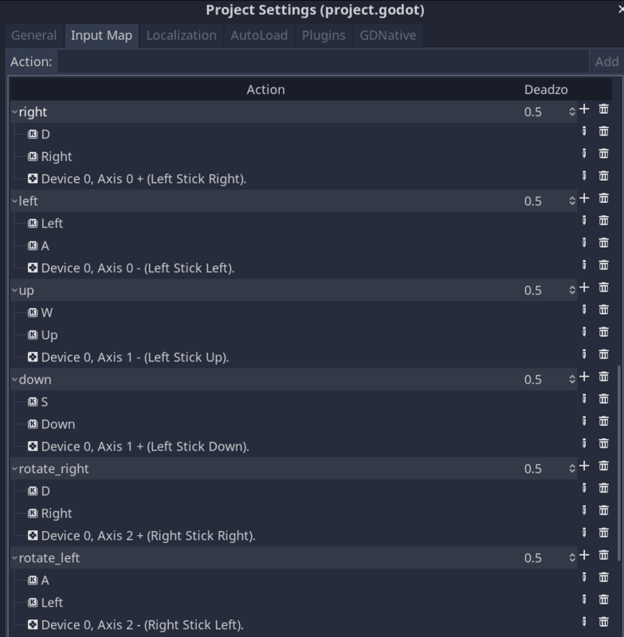
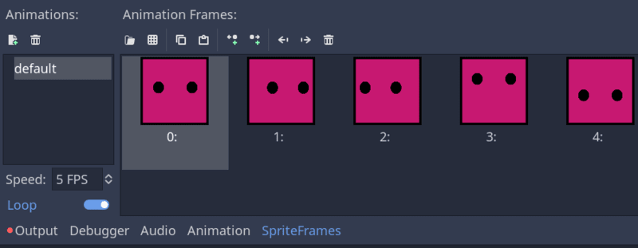

+++
title = "How to do top-down game movement in Godot"
menuTitle = "Top-down movement"
description = "Learn how to start moving your character with a top down view."
author = "raformatico"
coAuthors = ["nathan"]

date = 2021-02-14
weight = 5

difficulty = "beginner"
keywords = ["godot top down movement", "godot player movement"]

+++

In this tutorial, you will learn to implement three different movements for your characters in Godot:

1. Rotating and moving forward or backward, as seen in the classic space shooter _Asteroids_.
2. Moving in eight directions.
3. Using steering to make the motion smooth and organic.

You can find the full source code of the project [here](https://github.com/GDQuest/godot-mini-tuts-demos/tree/master/2d/top-down-movement).



## Input actions

We use input actions to link a specific event (keystrokes, mouse, or joystick interactions) with an action in our game.

For instance, if we want our character to jump when we press the space key, right-click, or the gamepad's _X_ button, we should link an action to these three events.

To create an action named _right_ open _Project -> Project Settings... -> Input Map_ write in the _Action_ field _right_ and press the _Add_ button. You can see this action has appeared in the list below.

Now, to link events to trigger this action, click on the + button you can find at the end of the field _right_ (the one you have just created). Add one _Key_ for the right arrow and another one for the _D_ key.

Finally, as we want to support analog movement (joysticks), add a _Joy Axis_ to the right.

You can review the rest of the actions you have to specify in the following image.



## Setting up the Player Scene

First, we'll create a base scene we can use to implement every movement.

We create a scene with a _KinematicBody2D_ named _PlayerTopDown_ as the root and two children: a _CollisionShape2D_ and an _AnimatedSprite_. We use an _AnimatedSprite_ here to change the character's texture depending on the movement direction.


In the _Inspector_, add a _New SpriteFrames_ in the `Frames` property of the _AnimatedSprite_ with all your character's textures. 


Remember the different sprites' indices, as you will have to match them with the directions in the code.



## Moving like a ship in space, as in Asteroids

Let's start with the asteroids' movement as it's the shortest and simplest.

We want some spaceship that rotates when we press `rotate_left` or `rotate_right`, moves forward when we press `up`, and backward when we press `down`.

In this tutorial, notice how we use `Input.get_action_strength()` to calculate the player's input direction. This function gives us support for analog controllers, like joysticks, allowing the player to move more precisely than with the keyboard.

The function will return `1.0` if you press a key on the keyboard and a value between `0.0` and `1.0` when using a joystick. This is why we can directly do subtractions with it.

Attach a script to the _PlayerTopDown_ node with the following code to implement this movement.

```gdscript
# Movement where the character rotates and moves forward or backward.
extends KinematicBody2D

# Movement speed in pixels per second.
export var speed := 500
# Rotation speed in radians per second.
export var angular_speed := 5.0


func _physics_process(delta):
	# See how we're using Input.get_action_strength() to calculate the direction we rotate.
	# The value will be in the [-1.0, 1.0] range.
	var rotate_direction := Input.get_action_strength("rotate_right") - Input.get_action_strength("rotate_left")
	rotation += rotate_direction * angular_speed * delta
	# Below, we calculate the forward or backward move direction and directly multiply it to calculate a velocity.
	# `transform.y` stores the node's local axes, allowing us to move it in the direction it's currently facing.
	var velocity := (Input.get_action_strength("down") - Input.get_action_strength("up")) * transform.y * speed
	move_and_slide(velocity)
```

## Top-down movement

To implement a top-down movement in eight directions, replace your _PlayerTopDown_ node's script with the following code. 

Below, we introduce a function to update our character's sprite. We also normalize our direction vector. Doing this ensures it always has a length of `1.0` (or `0.0` if the player isn't pressing any movement key).

Why? When you press both right and down without normalizing the vector, the direction calculation below will result in `Vector2(1, 1)`. Such a vector has a length of about `1.4` (it's the diagonal of a square of width `1.0`). But when you only press the right key, the vector would be `Vector2(1.0, 0.0)` and have a length of `1.0`. In that case, the character would end up moving 40% faster when going diagonally compared to moving left, right, up, or down. The `Vector2.normalized()` method prevents this issue.

```gdscript
extends KinematicBody2D

# Movement speed in pixels per second.
export var speed := 500

# We map a direction to a frame index of our AnimatedSprite node's sprite frames.
# See how we use it below to update the character's look direction in the game.
var _sprites := {Vector2.RIGHT: 1, Vector2.LEFT: 2, Vector2.UP: 3, Vector2.DOWN: 4}
var _velocity := Vector2.ZERO

onready var animated_sprite: AnimatedSprite = $AnimatedSprite


func _physics_process(_delta: float) -> void:
	# Once again, we call `Input.get_action_strength()` to support analog movement.
	var direction := Vector2(
		# This first line calculates the X direction, the vector's first component.
		Input.get_action_strength("right") - Input.get_action_strength("left"),
		# And here, we calculate the Y direction. Note that the Y-axis points 
		# DOWN in games.
		# That is to say, a Y value of `1.0` points downward.
		Input.get_action_strength("down") - Input.get_action_strength("up")
	)
	# When aiming the joystick diagonally, the direction vector can have a length 
	# greater than 1.0, making the character move faster than our maximum expected
	# speed. When that happens, we limit the vector's length to ensure the player 
	# can't go beyond the maximum speed.
	if direction.length() > 1.0:
		direction = direction.normalized()
	move_and_slide(speed * direction)


# The code below updates the character's sprite to look in a specific direction.
func _unhandled_input(event):
	if event.is_action_pressed("right"):
		_update_sprite(Vector2.RIGHT)
	elif event.is_action_pressed("left"):
		_update_sprite(Vector2.LEFT)
	elif event.is_action_pressed("down"):
		_update_sprite(Vector2.DOWN)
	elif event.is_action_pressed("up"):
		_update_sprite(Vector2.UP)


func _update_sprite(direction: Vector2) -> void:
	animated_sprite.frame = _sprites[direction]
```

## Smoother movement with steering behaviors

There's a series of little movement algorithms for games called steering behaviors that game developers use a lot. You can use them to smooth out your characters' movements and give them a bit of inertia. 

For this new movement, you need to add a new variable at the beginning of the previous script (`friction`), which will be controlling the inertia of the movement. You can play with this value to see how it affects your character movement.

A greater value will make your character react more rapidly. Lower values imply a higher time to reach the maximum speed or stop the movement.

```gdscript
# A factor that controls the character's inertia.
export var friction = 0.18
```

Change the previous `_physics_process` with this new method:

```gdscript
func _physics_process(delta):
	var direction := Vector2(
		Input.get_action_strength("right") - Input.get_action_strength("left"),
		Input.get_action_strength("down") - Input.get_action_strength("up")
	)
	if direction.length() > 1.0:
		direction = direction.normalized()
	# Using the follow steering behavior.
	var target_velocity = direction * speed
	_velocity += (target_velocity - _velocity) * friction
	_velocity = move_and_slide(_velocity)
```

You can use a steering behavior to arrive at a target point smoothly and accelerate and decelerate gradually.

These behaviors are commonly used for AI but also in arcade racing games and much more.

To learn more about steering behaviors, check out our [free intro to steering behaviors in Godot]().

## Bonus: loading different scenes with a keyboard shortcut

In the open-source demo we prepared for you, you can load different mini-game scenes by pressing <kbd>1</kbd>, <kbd>2</kbd>, or <kbd>3</kbd> on your keyboard. Here's how we achieved that, as a bonus.

There are three scenes to test all the movements with a similar structure but changing the player node. These scenes are composed of an instantiated scene (_Level1_) with some obstacles, a _Sprite_ for the level background, and a _StaticBody2D_ to set the limits of the level.

They have another instantiated scene (_SceneIndicator_) to show a title with the name of the movement we are testing.


And finally, they have four particle emitters to generate little white squares you see moving in the back (just for aesthetic reasons).


We have changed the background default color of the scene. You can do this in _Project -> Project Settings... -> Rendering -> Environment -> Default Clear Color_.


And finally, the following script changes the scene depending on the number you pressed (1-3):

```gdscript
extends Node2D

var topdown_scene := "res://Levels/DemoTopdown.tscn"
var topdown_acceleration_scene := "res://Levels/DemoTopdownAcceleration.tscn"
var rotate_move_scene := "res://Levels/DemoRotate.tscn"


func _unhandled_input(event):
	if event.is_action_pressed("load_topdown"):
		get_tree().change_scene(topdown_scene)
	elif event.is_action_pressed("load_topdown_acc"):
		get_tree().change_scene(topdown_acceleration_scene)
	elif event.is_action_pressed("load_rotate_move"):
		get_tree().change_scene(rotate_move_scene)
```

Remember to add these three actions to the project's input maps, as we have seen before.
