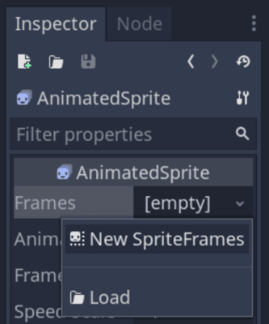
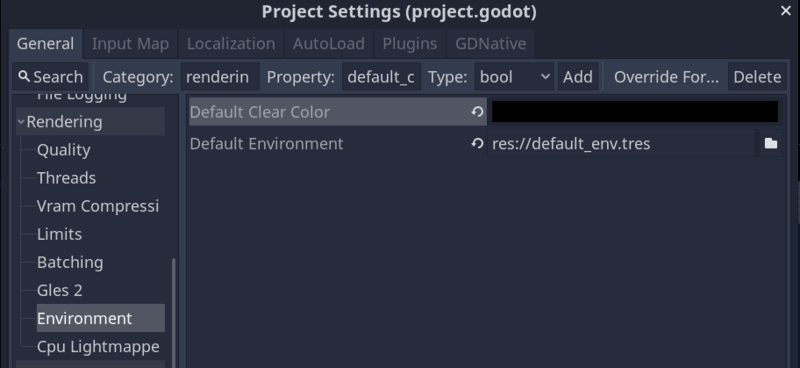

+++
title = "Top-down movements"
description = "Learn how to start moving your character with a top down view."
author = "raformatico"
coAuthors = ["nathan"]

date = 2021-02-14
weight = 5

difficulty = "beginner"
keywords = ["godot top down movement", "godot player movement"]

+++

In this tutorial, you will learn to implement three different movements for your character in Godot:
1. Rotate and move forward/backwards. A similar movement to the typical space ship game, like _Asteroids_.
2. Basic top-down movement in eight directions.
3. Top-down movement with steering behavior to make the movement more organic.



You can find the full source code of the project [here](https://github.com/GDQuest/godot-mini-tuts-demos/tree/master/2d/top-down-movement).

## Input actions

Below, you will see we have some input actions we defined in the _Project -> Project Settings... -> Input Map_. The last three are related to how we change the scene to test all the different movements, we will show this at the end of the tutorial as a bonus knowledge pill.


## Setting up the Player Scene

First, we create a scene and add a _KinematicBody2D_ as its parent node and two children a _CollisionShape2D_ and an _AnimatedSprite_. We use here an _AnimatedSprite_ as we will be changing its texture depending on the direction of the movement, you can use a regular _Sprite_ node if you are not going to do this.


In the _Inspector_, add a _New SpriteFrames_ in the `Frames` property of the _AnimatedSprite_ with all the textures of your character. 



Remember the indexes of the different textures, as you will have to match them with the directions in the code.


The final step is to add a script to the root node (_KinematicBody2D_) coding the movement you want to implement (see sections below).

## Rotate and move forward/backwards

In this movement, we do not change the texture as we will be rotating the character and moving it in the `y` direction, attach a script to the _KinematicBody2D_ with the following code to implement this movement.

```gdscript
# Movement where the character rotates and moves forward or backward.
extends KinematicBody2D

# Movement speed in pixels per second.
export var speed := 500
# Rotation speed in radians per second.
export var angular_speed := 5.0


func _physics_process(delta):
	var rotate_direction := Input.get_action_strength("right") - Input.get_action_strength("left")
	rotation += rotate_direction * angular_speed * delta
	# `transform.y` stores the node's local axes, allowing us to move it in the direction it's currently facing.
	var velocity := (Input.get_action_strength("down") - Input.get_action_strength("up")) * transform.y * speed
	move_and_slide(velocity)
```

## Top-down movement

To implement a top-down movement in eight directions attach a script to the _KinematicBody2D_ root node with the following code.

```gdscript
extends KinematicBody2D

# Movement speed in pixels per second.
export var speed := 500

# Mapping of direction to a sprite index.
var _sprites := {Vector2.RIGHT: 1, Vector2.LEFT: 2, Vector2.UP: 3, Vector2.DOWN: 4}
var _velocity := Vector2.ZERO

onready var animated_sprite: AnimatedSprite = $AnimatedSprite


func _physics_process(_delta: float) -> void:
	var direction := Vector2(
		Input.get_action_strength("right") - Input.get_action_strength("left"),
		Input.get_action_strength("down") - Input.get_action_strength("up")
	).normalized()
	move_and_slide(speed * direction)


# The code below updates the character's sprite to look in a specific direction.
func _unhandled_input(event):
	if event.is_action_pressed("right"):
		_update_sprite(Vector2.RIGHT)
	elif event.is_action_pressed("left"):
		_update_sprite(Vector2.LEFT)
	elif event.is_action_pressed("down"):
		_update_sprite(Vector2.DOWN)
	elif event.is_action_pressed("up"):
		_update_sprite(Vector2.UP)


func _update_sprite(direction: Vector2) -> void:
	animated_sprite.frame = _sprites[direction]

```

In the previous code, we used `get_action_strength()` instead of `is_action_pressed()` to take into account the intensity of an analog stick.  

If the control used to play the game is a keyboard, the value returned will be 0 or 1. 

## Adding steering behavior

If you want to get a more organic movement you can change the previous `physics_process` function with this one. This way the character will approach smoothly to the target point:

```gdscript
func _physics_process(delta):
	var direction := Vector2(
		Input.get_action_strength("right") - Input.get_action_strength("left"),
		Input.get_action_strength("down") - Input.get_action_strength("up")
	).normalized()
	# Using the follow steering behavior.
	var target_velocity = direction * speed
	_velocity += (target_velocity - _velocity) * friction
	_velocity = move_and_slide(_velocity)

```

You can use a steering behavior not only for approaching the target point but also for accelerating upto the maximum speed. For a more in-depth study of steering behaviors, go and check out our [intro to steering behaviors](https://www.gdquest.com/tutorial/godot/2d/intro-to-steering-behaviors/).

## Bonus! Setting up the Scenes to Test Different Movements

There are three scenes to test all the movements with a similar structure but changing the player node. These scenes are composed of an instantiated scene (_Level1_) with some obstacles, a _Sprite_ for the level background and a _StaticBody2D_ to set the limits of the level. They have another instantiated scene (_SceneIndicator_) to show a title with the name of the movement we are testing.


And finally, they have 4 particle emitters to generate little white squares you see moving in the back (just for aesthetic reasons).


We have changed the background default color of the scene, you can do this in _Project -> Project Settings... -> Rendering -> Environment -> Default Clear Color_.



And finally, the following script changes the scene depending on the number you pressed (1-3):

```gdscript
extends Node2D

var topdown_scene := "res://Levels/DemoTopdown.tscn"
var topdown_acceleration_scene := "res://Levels/DemoTopdownAcceleration.tscn"
var rotate_move_scene := "res://Levels/DemoRotate.tscn"


func _unhandled_input(event):
	if event.is_action_pressed("load_topdown"):
		get_tree().change_scene(topdown_scene)
	elif event.is_action_pressed("load_topdown_acc"):
		get_tree().change_scene(topdown_acceleration_scene)
	elif event.is_action_pressed("load_rotate_move"):
		get_tree().change_scene(rotate_move_scene)
```

