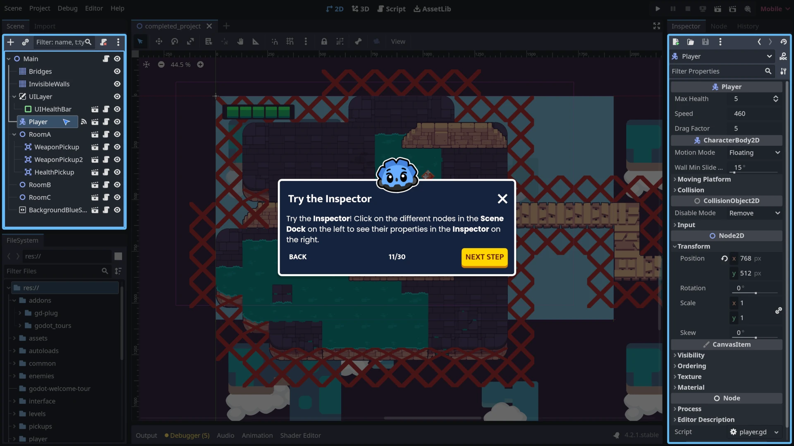

With Godot 4, to help you get your foot in the door, we developed an <abbr title="Educational Technology">EdTech</abbr> called **Godot Tours** that allows you to learn interactively, step-by-step, directly inside the Godot Editor.

In this first completely Free Tour, we take you on a quick guided walk through the user interface and help you find your way around the editor and break the ice with Godot.

Download the tour project files:



### How to use

1. Click the download button above to download a Godot project containing the tour.
2. Import the project in Godot. You will need Godot **4.3 standard** (*not* the .NET edition) for this to work.
3. Activate the Godot Tours plugin.
  1. Click on *Project -> Project Settings...* at the top left of the editor.
  2. A pop-up window opens. Click on the *Plugins* tab.
  3. The tab lists plugins that are available in the project. Notice the empty check box to the right of the Godot Tours plugin. Click the checkbox to enable the plugin.

Shortly after enabling the plugin, you should see the editor dim down behind the window. Click the *Close* button at the bottom of the Project Settings window to close it.

You will see a menu listing the tours available in the project. Click the first tour in the menu to select it (*101: The Godot Editor*), and then click the *START LEARNING* button at the bottom to get started.

### How to import Godot project files in the Godot editor

The download button above downloads a ZIP file. To import it in Godot, you need to:

1. Extract the Godot project files from the ZIP file. It will create a new folder that contains many files, and most notably a file named `project.godot`.
2. Run the Godot engine.
3. In the Project Manager window that appears, click the *Import* button at the top-left.
4. Navigate to the `project.godot` file you extracted earlier and open it.
5. Click the *Import & Edit* button.

**Unzipping a ZIP file on Windows:**

Using the File Explorer: Right-click the ZIP file and select "Extract All" from the context menu.

**Unzipping a ZIP file on macOS:**

Double-click the ZIP file to automatically extract the contents of the ZIP file.

**Unzipping a ZIP file on Linux:**

Many file browsers on Linux. Have a right-click command to extract the contents of a ZIP file.

In Gnome files (also known as Nautilus), for example, you can right-click on a ZIP file and select "Extract Here".
In KDE's file manager, Dolphin, you can right-click on the ZIP file and select "Extract > Extract Archive Here".

## Your questions

### What's a ZIP file?

A ZIP file is like a folder that can hold multiple files or directories (folders inside folders) but as a single file on your computer, making it much easier to share online and download.

It also stores data in a compressed format. This means that the ZIP file takes up less space than the individual files or directories would, making it faster to download, to upload, and more lightweight to store.

### What's a Godot project?

A Godot project is a collection of files and folders that represent a game or application made using the Godot game engine. It contains all the assets, code, and settings of a game project or computer program.
